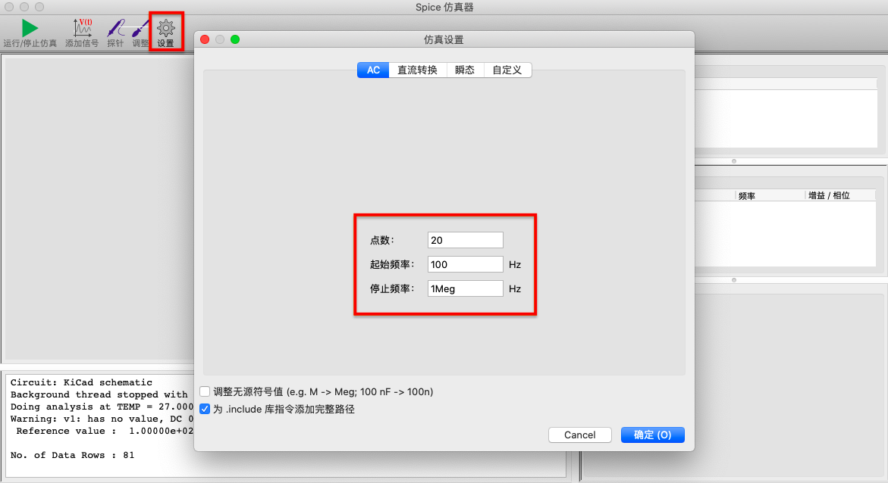
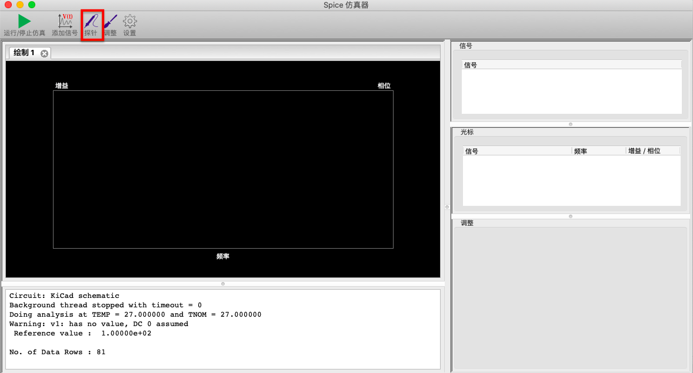
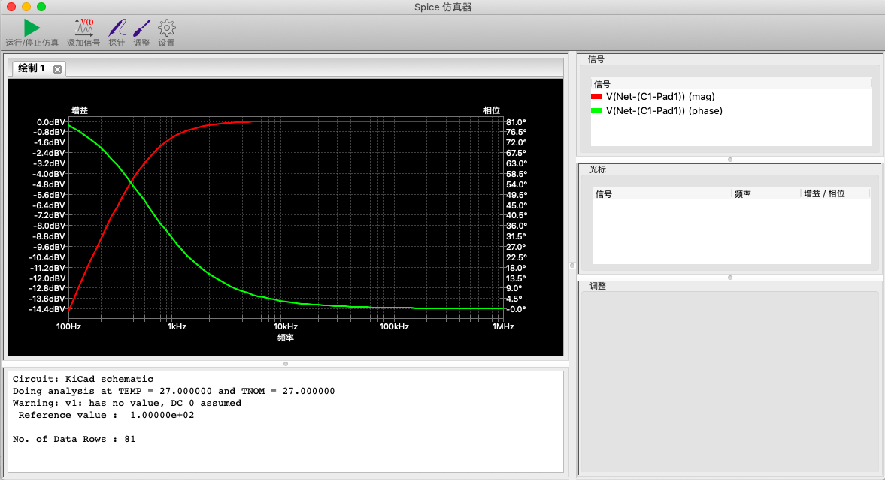

# spice simulation in Kicad

This is inspired by https://www.youtube.com/watch?v=bPBu2eHvK6I

# How To

Open the Kicad.pro project

Select simulator in the Kicad Menu and config the simulation session:

After press the Big green "play" button, select the probing position:

The result will be shown

